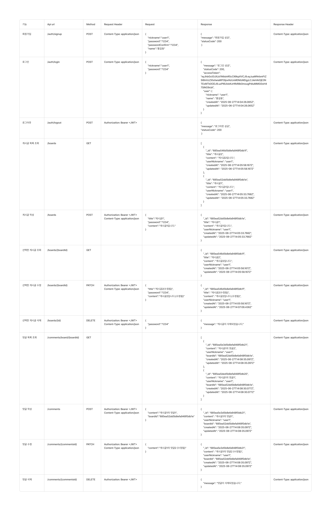

## 프로젝트 요약 (Summary)

<aside>
Nest.JS로 CRUD, 로그인, 회원가입, 댓글 기능 구현하기
</aside>

## 목표 (Goals)

- NestJS와 TypeORM을 사용한 게시판 CRUD API 구현
- MongoDB Atlas를 활용
- 게시글 작성, 조회, 수정, 삭제 기능 완성
- 댓글 시스템 구현 (작성, 조회, 수정, 삭제)
- 회원가입 및 로그인 시스템 구현
- JWT 기반 인증 시스템 구현
- 비밀번호 기반 게시글 보안 기능 구현
- RESTful API 설계 및 구현
- 유효성 검사

## 계획 (Plan)

<details>
<summary><strong>유스케이스, API명세서 (클릭하여 펼치기)</strong></summary>

### 유스케이스 (UseCase)


### API명세서 (API Specification)


</details>

### 기술 스택 (Tech Stack)
- **Backend Framework**: NestJS
- **Database**: MongoDB Atlas
- **ORM**: TypeORM
- **Validation**: class-validator, class-transformer
- **Authentication**: JWT (jsonwebtoken)
- **Language**: TypeScript

### 아키텍처 설계

<details>
<summary><strong>DB 설계, 프로젝트 구조 (클릭하여 펼치기)</strong></summary>

#### 1. 데이터베이스 설계
```
users 컬렉션:
{
  _id: ObjectId,
  nickname: String,         // 닉네임 (고유값)
  password: String,         // 암호화된 비밀번호
  createdAt: Date,          // 가입일
  updatedAt: Date           // 수정일
}

posts 컬렉션:
{
  _id: ObjectId,
  title: String,           // 제목
  author: String,          // 작성자명
  password: String,        // 비밀번호
  content: String,         // 내용
  createdAt: Date,         // 작성시간
  updatedAt: Date          // 수정시간
}

comments 컬렉션:
{
  _id: ObjectId,
  postId: ObjectId,        // 게시글 ID (참조)
  content: String,         // 댓글 내용
  createdAt: Date,         // 작성시간
  updatedAt: Date          // 수정시간
}
```

#### 2. 프로젝트 구조
```
src/
├── dto/                   // DTO
│   ├── auth/
│   │   ├── signup.dto.ts
│   │   └── login.dto.ts
│   ├── create-board.dto.ts
│   ├── update-board.dto.ts
│   ├── create-comment.dto.ts
│   └── update-comment.dto.ts
├── entities/              // TypeORM 엔티티
│   ├── user.entity.ts
│   ├── board.entity.ts
│   └── comment.entity.ts
├── repositories/          // 데이터베이스 접근 계층
│   ├── user.repository.ts
│   ├── board.repository.ts
│   └── comment.repository.ts
├── services/              // 비즈니스 로직 계층
│   ├── auth.service.ts
│   ├── board.service.ts
│   └── comment.service.ts
├── controllers/           // API 엔드포인트
│   ├── auth.controller.ts
│   ├── board.controller.ts
│   └── comment.controller.ts
├── guards/                // 인증 가드
│   └── jwt-auth.guard.ts
├── strategies/            // JWT 전략
│   └── jwt.strategy.ts
└── configs/               // 설정 파일
    └── typeorm.config.ts
```
</details>

#### 3. 구현 방식

**DTO (Data Transfer Object) 활용**
- `SignupDto`: 회원가입 시 유효성 검사 (닉네임, 비밀번호, 비밀번호 확인)
- `LoginDto`: 로그인 시 유효성 검사 (닉네임, 비밀번호)
- `CreateBoardDto`: 게시글 생성 시 유효성 검사
- `UpdateBoardDto`: 게시글 수정 시 유효성 검사
- `CreateCommentDto`: 댓글 생성 시 유효성 검사
- `UpdateCommentDto`: 댓글 수정 시 유효성 검사

**Repository 패턴**
- TypeORM Repository를 래핑한 커스텀 Repository 클래스 구현
- 데이터베이스 접근 로직을 Service와 분리
- 재사용 가능한 데이터베이스 쿼리 메서드 제공

**TypeORM 활용**
- MongoDB 연결 및 엔티티 매핑
- 관계 설정 (사용자 ↔ 게시글 ↔ 댓글)
- 자동 타임스탬프 생성
- 쿼리 빌더를 통한 효율적인 데이터 조회

**JWT 인증 시스템**
- JWT 토큰 생성 및 검증
- 쿠키 기반 토큰 전송
- 인증 가드를 통한 보호된 라우트 구현


#### 4. API 설계

<details>
<summary><strong>요구사항 (클릭하여 펼치기)</strong></summary>


```
1. 전체 게시글 목록 조회 API
    - 제목, 작성자명, 작성 날짜를 조회하기
    - 작성 날짜 기준으로 내림차순 정렬하기
2. 게시글 작성 API
    - 제목, 작성자명, 비밀번호, 작성 내용을 입력하기
3. 게시글 조회 API
    - 제목, 작성자명, 작성 날짜, 작성 내용을 조회하기 
    (검색 기능이 아닙니다. 간단한 게시글 조회만 구현해주세요.)
4. 게시글 수정 API
    - API를 호출할 때 입력된 비밀번호를 비교하여 동일할 때만 글이 수정되게 하기
5. 게시글 삭제 API
    - API를 호출할 때 입력된 비밀번호를 비교하여 동일할 때만 글이 삭제되게 하기
6. 댓글 목록 조회
    - 조회하는 게시글에 작성된 모든 댓글을 목록 형식으로 볼 수 있도록 하기
    - 작성 날짜 기준으로 내림차순 정렬하기
7. 댓글 작성
    - 댓글 내용을 비워둔 채 댓글 작성 API를 호출하면 "댓글 내용을 입력해주세요" 라는 메세지를 return하기
    - 댓글 내용을 입력하고 댓글 작성 API를 호출한 경우 작성한 댓글을 추가하기
8. 댓글 수정
    - 댓글 내용을 비워둔 채 댓글 수정 API를 호출하면 "댓글 내용을 입력해주세요" 라는 메세지를 return하기
    - 댓글 내용을 입력하고 댓글 수정 API를 호출한 경우 작성한 댓글을 수정하기
9. 댓글 삭제
    - 원하는 댓글을 삭제하기

1. 회원 가입 API
- 닉네임, 비밀번호, 비밀번호 확인을 **request**에서 전달받기
- 닉네임은 `최소 3자 이상, 알파벳 대소문자(a~z, A~Z), 숫자(0~9)`로 구성하기
- 비밀번호는 `최소 4자 이상이며, 닉네임과 같은 값이 포함된 경우 회원가입에 실패`로 만들기
- 비밀번호 확인은 비밀번호와 정확하게 일치하기
- 데이터베이스에 존재하는 닉네임을 입력한 채 회원가입 버튼을 누른 경우 "중복된 닉네임입니다." 라는 에러메세지를 **response**에 포함하기

2. 로그인 API
- 닉네임, 비밀번호를 **request**에서 전달받기
- 로그인 버튼을 누른 경우 닉네임과 비밀번호가 데이터베이스에 등록됐는지 확인한 뒤, 하나라도 맞지 않는 정보가 있다면 "닉네임 또는 패스워드를 확인해주세요."라는 에러 메세지를 **response**에 포함하기
- 로그인 성공 시, 로그인에 성공한 유저의 정보를 JWT를 활용하여 클라이언트에게 Cookie로 전달하기
```

</details>

**인증 API**
```
POST   /auth/signup         # 회원가입
POST   /auth/login          # 로그인
POST   /auth/logout         # 로그아웃
```

**게시글 API**
```
GET    /boards              # 전체 게시글 목록 조회
GET    /boards/:id          # 특정 게시글 조회
POST   /boards              # 게시글 작성
PUT    /boards/:id          # 게시글 수정 (비밀번호 확인)
DELETE /boards/:id          # 게시글 삭제 (비밀번호 확인)
```

**댓글 API**
```
GET    /boards/:id/comments # 게시글의 댓글 목록 조회
POST   /boards/:id/comments # 댓글 작성
PUT    /comments/:id        # 댓글 수정
DELETE /comments/:id        # 댓글 삭제
```


#### 5. 보안 및 유효성 검사
• **회원가입 유효성 검사**
  - 닉네임: 최소 3자 이상, 알파벳 대소문자(a~z, A~Z), 숫자(0~9)
  - 비밀번호: 최소 4자 이상이며, 닉네임과 같은 값이 포함된 경우 회원가입에 실패
  - 비밀번호 확인: 비밀번호와 정확하게 일치
  - 닉네임 중복 검사

• **로그인 보안**
  - DB에서 닉네임, 비밀번호 확인
  - JWT 토큰 기반 인증
  - 쿠키 기반 토큰 전송

<!-- • **게시글 보안**
  - 비밀번호 기반 게시글 수정/삭제 인증
  - class-validator를 통한 입력 데이터 유효성 검사 -->

• **댓글 유효성 검사**
  - 댓글 내용 빈 값 검증

#### 6. 에러 처리
- 400 Bad Request: 잘못된 요청 데이터, 유효성 검사 실패
- 401 Unauthorized: 비밀번호 불일치, 인증 실패
- 409 Conflict: 중복된 닉네임
- 404 Not Found: 리소스를 찾을 수 없음
- 500 Internal Server Error: 서버 내부 오류

#### 7. 테스트

**Docker Compose 실행**
```bash
# 서비스 시작
docker-compose build
docker-compose up -d
```

**API 테스트**

**1. 게시글 API**
```bash
# 전체 게시글 목록 조회
GET http://localhost/boards

# 특정 게시글 조회
GET http://localhost/boards/:id

# 게시글 작성
POST http://localhost/boards
Content-Type: application/json

{
  "title": "테스트 게시글",
  "author": "테스트 작성자",
  "password": "1234",
  "content": "테스트 내용입니다."
}

# 게시글 수정
PUT http://localhost/boards/:id
Content-Type: application/json

{
  "title": "수정된 제목",
  "content": "수정된 내용",
  "password": "1234"
}

# 게시글 삭제
DELETE http://localhost/boards/:id
Content-Type: application/json

{
  "password": "1234"
}
```

**2. 댓글 API**
```bash
# 게시글의 댓글 목록 조회


# 댓글 작성


# 댓글 수정


# 댓글 삭제
```

**3. 인증 API**
```bash
# 회원가입

# 로그아웃
```